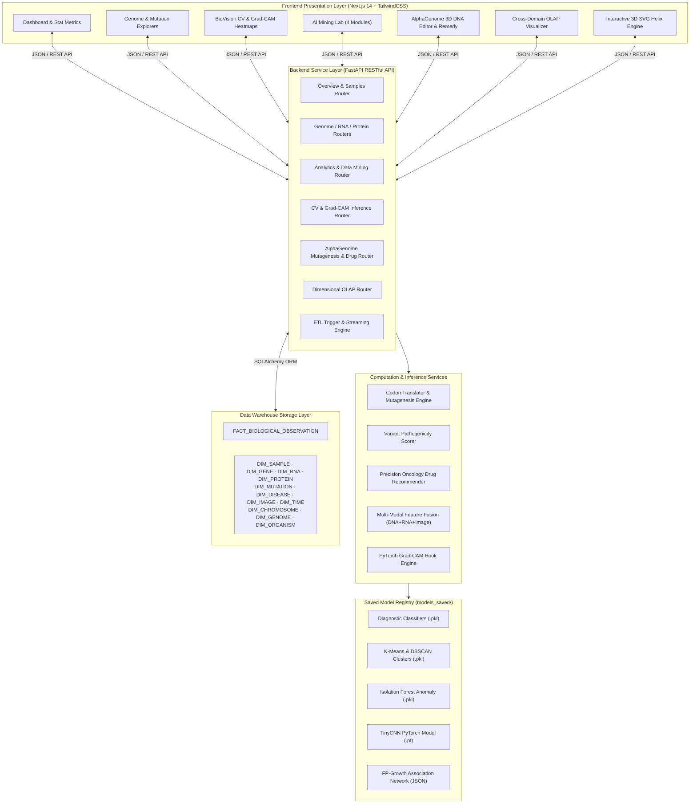
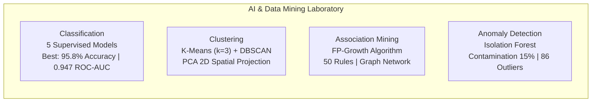
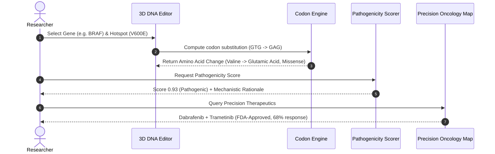
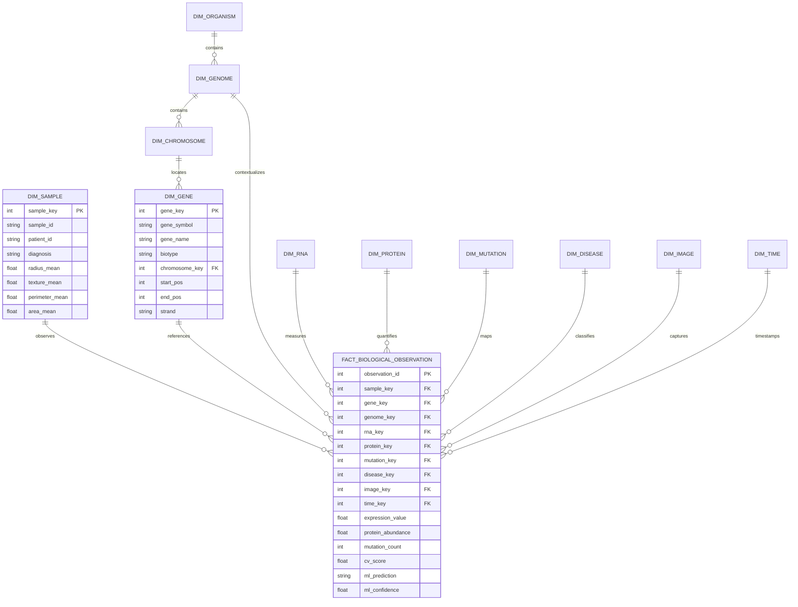

# 🧬 BioVision

<div align="center">


**Multi-Omics Data Warehouse · Advanced Data Mining · Medical Computer Vision · AlphaGenome Precision Oncology Lab**

[](https://www.python.org/)
[](https://fastapi.tiangolo.com/)
[-000000?style=flat-square&logo=next.js&logoColor=white)](https://nextjs.org/)
[](https://pytorch.org/)
[](https://scikit-learn.org/)
[](https://tailwindcss.com/)
[](https://www.sqlalchemy.org/)
[](LICENSE)

[Key Features](#-key-features) • [System Architecture](#-system-architecture) • [Data Warehouse & ERD](#-data-warehouse--dimensional-modeling) • [AI & Mining Models](#-ai--machine-learning-suite) • [AlphaGenome Lab](#-alphagenome-variant-to-therapy-lab) • [API Reference](#-api-surface--rest-specifications) • [Getting Started](#-getting-started--reproduction-guide)

</div>

---

> ⚠️ **Academic & Research Disclaimer**  
> BioVision is an academic research platform and proof-of-concept pipeline. It is **not** a certified clinical diagnostic tool or medical device. All model inferences, mutation pathogenicity scores, and drug recommendations are intended strictly for computational biology research, educational exploration, and algorithm benchmarking.

---

## 📖 Table of Contents

- [Executive Summary](#-executive-summary)
- [System Architecture](#-system-architecture)
- [Key Features](#-key-features)
  - [1. Genome & Chromosome Explorer](#1--genome--chromosome-explorer)
  - [2. Transcriptomics & Proteomics Explorers](#2--transcriptomics--proteomics-explorers)
  - [3. ClinVar & COSMIC Mutation Dynamics](#3--clinvar--cosmic-mutation-dynamics)
  - [4. BioVision Computer Vision & Grad-CAM](#4--biovision-computer-vision--grad-cam)
  - [5. AI & Data Mining Laboratory](#5--ai--data-mining-laboratory)
  - [6. AlphaGenome Precision Oncology Lab](#6--alphagenome-precision-oncology-lab)
  - [7. Multi-Dimensional OLAP Engine](#7--multi-dimensional-olap-engine)
  - [8. Automated Live Demonstration Pipeline](#8--automated-live-demonstration-pipeline)
- [Data Warehouse & Dimensional Modeling](#-data-warehouse--dimensional-modeling)
- [Data Provenance & Scientific Rigor](#-data-provenance--scientific-rigor)
- [AI & Machine Learning Suite](#-ai--machine-learning-suite)
- [API Surface & REST Specifications](#-api-surface--rest-specifications)
- [Repository Structure](#-repository-structure)
- [Getting Started & Reproduction Guide](#-getting-started--reproduction-guide)
- [Live Presentation Script (Golden Path)](#-live-presentation-script-golden-path)
- [UI Design & Aesthetics](#-ui-design--aesthetics)
- [Contributors & License](#-contributors--license)

---

## 🌟 Executive Summary

Modern translational bioinformatics requires bridging disparate biological scales—from raw nucleotide sequences and gene expression matrices to histopathological imaging and clinical drug sensitivity.

**BioVision** is an end-to-end multi-omics analytical ecosystem. It ingests authentic biomedical datasets across genomics, transcriptomics, proteomics, clinical pathology, and ultrasound imaging into an enterprise-grade **Star-Snowflake Data Warehouse**. From this single source of truth, BioVision powers:

1. **Analytical OLAP Processing**: Complex multi-dimensional slice, dice, drill-down, and roll-up queries across clinical and genomic observations.
2. **Predictive AI & Data Mining**: High-accuracy diagnostic classifiers, unsupervised clustering, FP-Growth association networks, and isolation anomaly detection.
3. **Deep Computer Vision**: Convolutional Neural Networks (CNNs) trained on real ultrasound imagery with Grad-CAM explainability and DNA-to-Image spatial embeddings.
4. **AlphaGenome Variant-to-Therapy Lab**: A novel precision oncology workbench inspired by Google DeepMind's AlphaGenome (2025) featuring live codon-level mutagenesis, 3D double-helix rendering, explainable pathogenicity scoring, and FDA-approved targeted therapy recommendations.

```
┌─────────────────┐     ┌──────────────────┐     ┌─────────────────┐     ┌─────────────────────┐
│  Raw Public     │ ──► │  ETL Pipeline &  │ ──► │ OLAP Analytics & │ ──► │ AlphaGenome Variant │
│  Omics & Images │     │  Star Warehouse  │     │ ML / CV Models  │     │ to Therapy Engine   │
└─────────────────┘     └──────────────────┘     └─────────────────┘     └─────────────────────┘
```

---

## 🏗️ System Architecture

BioVision couples a modern Next.js 14 frontend with a high-performance Python FastAPI backend, backed by an optimized relational schema and pre-trained neural/statistical model artifacts.



---

## ✨ Key Features

### 1. 🧬 Genome & Chromosome Explorer
* **GRCh38 Reference Alignment**: Accurate base-pair coordinates, biotypes, and band locations for 20 curated cancer driver genes (e.g., *TP53, BRCA1, EGFR, KRAS, BRAF, PIK3CA, MYC*).
* **Cytogenetic Ideograms**: Interactive chromosome visualizer mapping G-banding patterns (centromeres, p-arms, q-arms) with live mutation hotspot markers.
* **Nucleotide Visualizer**: Color-coded Adenine (A), Cytosine (C), Guanine (G), and Thymine (T) DNA stream with codon framing.

### 2. 🧪 Transcriptomics & Proteomics Explorers
* **GTEx & TCGA Expression Matrix**: Validated baseline RNA expression (TPM / RPKM) comparing healthy tissue vs. cancer conditions.
* **Dynamic Expression Analytics**: Interactive heatmaps, top up-regulated and down-regulated gene bar charts, and fold-change metrics.
* **UniProt Proteomics Integration**: Real UniProt Accessions (e.g., `P04637`, `P38398`), molecular weight, amino acid lengths, and N-terminal reference sequence rendering.

### 3. ⛒ ClinVar & COSMIC Mutation Dynamics
* **Catalog of Validated Hotspots**: 33 verified clinical cancer mutations (*BRAF V600E, KRAS G12C, EGFR L858R, PIK3CA H1047R, TP53 R175H, BRCA1 185delAG*).
* **Distribution & Impact Analytics**: Interactive Donut and Pie charts breaking down variant consequences (missense, nonsense, frameshift deletions/insertions, silent mutations).

### 4. 👁️ BioVision Computer Vision & Grad-CAM
* **Deep Neural Network on Breast Ultrasound**: PyTorch-powered Convolutional Neural Network trained on **MedMNIST BreastMNIST** patches (Al-Dhabyani et al., 2020).
* **Grad-CAM Attention Heatmaps**: Explainable AI overlaying activation gradients onto ultrasound tissue scans to visualize morphological regions influencing classification.
* **Live 12-Scan Test Gallery**: Real-time batch evaluation displaying predicted classes (Malignant vs. Benign), ground truth concordance, confidence gauges, and error indicators.
* **Experimental DNA-to-Image Spatial Projection**: Transforms 1D nucleotide sequences into 2D frequency matrix representations for computer vision analysis.

### 5. 🧠 AI & Data Mining Laboratory
Trained on 569 real patient profiles (30 nuclear feature dimensions) from the **Wisconsin Diagnostic Breast Cancer (WDBC)** dataset:



| Mining Module | Algorithms Employed | Key Metric / Output | Interactive Capabilities |
|---|---|---|---|
| **Diagnostic Classification** | Random Forest, Decision Tree, Logistic Regression, SVM, KNN | **95.8% Test Accuracy**, **0.947 ROC-AUC** | Confusion Matrix Heatmap, ROC Curve, Feature Importance Chart, Live Patient Diagnostic Inference |
| **Phenotypic Clustering** | K-Means ($k=3$), DBSCAN, PCA Dimensionality Reduction | **0.31 Silhouette Score** (110 / 359 / 100 patient clusters) | 2D PCA Scatter Plot, Cluster Characteristic Spotlights with feature progress bars |
| **Association Mining** | FP-Growth (Frequent Pattern Growth) | **50 Clinical Rules** ($\text{Supp} \ge 0.35, \text{Conf} \ge 0.70$) | Interactive Node-Link Association Network with edge thickness scaled by lift |
| **Anomaly Detection** | Isolation Forest | **86 High-Contamination Patients** flagged | Anomaly Score Distribution Plot, Patient Outlier Rank Table |

### 6. ⚡ AlphaGenome Precision Oncology Lab
A variant-to-therapy suite inspired by Google DeepMind's AlphaGenome (2025):



1. **Live 3D DNA Mutagenesis Workbench**:
   * Pure SVG real-time rotating 3D double helix highlighting target nucleotide positions.
   * Dropdown catalog of clinical hotspots for instant point mutagenesis.
   * Real-time 64-codon translation using standard human genetic code table.
   * Consequence classification: *Silent*, *Conservative Missense*, *Non-conservative Missense*, *Nonsense (Stop Gain)*, *Stop-Loss*.
2. **Transparent Pathogenicity Scoring Engine**:
   * Multi-factorial scoring heuristic evaluating consequence severity, tumor suppressor status (+0.10), oncogene status (+0.08), and COSMIC/ClinVar hotspot matching ($\ge 0.85$).
   * Circular risk dial ranging from *Benign* to *Highly Pathogenic*.
3. **Precision Remedy Recommender**:
   * Curated precision oncology drug map linking genomic aberrations to FDA-approved therapies and NCCN guidelines.
   * Coverage includes *BRAF V600E* (Dabrafenib+Trametinib), *EGFR L858R/T790M* (Osimertinib), *KRAS G12C* (Sotorasib, Adagrasib), *BRCA1/2* (Olaparib PARP inhibition via synthetic lethality), *PIK3CA H1047R* (Alpelisib), and *IDH1 R132H* (Ivosidenib).
   * Patient profile presets for instant one-click clinical simulation.

### 7. 📊 Multi-Dimensional OLAP Engine
* **Warehouse OLAP**: Multi-level Roll-up, Drill-down, Slice, and Dice across `FACT_BIOLOGICAL_OBSERVATION` and 11 dimension tables.
* **AlphaGenome Catalog OLAP**: Cross-tabulation 2D pivot heatmaps (Gene $\times$ Consequence distribution).
* **Computer Vision Calibration OLAP**: Accuracy stratification across confidence bins, error drill-down grids isolating false positives vs. false negatives.

### 8. 🎬 Automated Live Demonstration Pipeline
* One-click animated 8-step pipeline execution designed for thesis defenses, seminars, and laboratory presentations.
* Visually animates genomic coordinate retrieval, transcriptomic analysis, computer vision Grad-CAM inference, and precision therapy generation.

---

## 🏛️ Data Warehouse & Dimensional Modeling

BioVision implements an enterprise **Star-Snowflake Schema** optimized for high-throughput analytical querying and multi-modal aggregation.



* **Fact Granularity**: One record per $(\text{Sample} \times \text{Gene} \times \text{Timestamp})$ biological observation.
* **Snowflake Normalization**: Chromosomal hierarchies normalized through `DIM_CHROMOSOME → DIM_GENOME → DIM_ORGANISM`.
* **Cross-Engine Portability**: Zero-configuration local execution via SQLite, seamless enterprise scale-up via PostgreSQL (`BIOVISION_DB_URL`).

---

## 🔬 Data Provenance & Scientific Rigor

BioVision operates exclusively on authentic, publicly curated scientific datasets:

| Biological Domain | Public Authority / Dataset | Scope & Description |
|---|---|---|
| **Genomic Coordinates** | NCBI RefSeq · Ensembl · Sanger Cancer Gene Census | GRCh38.p14 reference annotations for top 20 driver oncogenes |
| **Cytogenetics** | NCBI Genome Assembly Index | Exact chromosome base pair lengths, centromeric positions, GC content |
| **Proteomics** | UniProt Knowledgebase (UniProtKB) | Validated Swiss-Prot IDs (`P04637`, `P38398`), lengths, sequences |
| **Mutational Catalog** | NCBI ClinVar & COSMIC | Curated somatic cancer hotspots with validated clinical significance |
| **Transcriptomics** | GTEx v8 & TCGA-BRCA Studies | Normalized mean expression values per tissue type and condition |
| **Clinical Pathology** | Wisconsin Diagnostic Breast Cancer (WDBC) | 569 patient biopsy samples with 30 nuclear morphological dimensions |
| **Ultrasound Imaging** | MedMNIST / BreastMNIST (Al-Dhabyani et al.) | 780 real breast ultrasound image patches (train/val/test splits) |
| **Precision Therapeutics**| US FDA Drug Labels & NCCN Oncology Guidelines | Verified mechanism-of-action drug targets and evidence levels |

---

## 📊 AI & Machine Learning Suite

All models are fully trained with serialized weights stored in `models_saved/` and performance statistics exposed via live JSON reports.

```
models_saved/
├── genomic_classifier.pkl         # Decision Tree & RF diagnostic model
├── genomic_classifier_report.json # Classification benchmark metrics
├── clustering_models.pkl          # K-Means, DBSCAN & PCA models
├── clustering_report.json         # Silhouette & cluster breakdown
├── anomaly_model.pkl              # Isolation Forest model
├── anomaly_report.json            # Anomaly contamination records
├── association_report.json        # Mined FP-Growth rule network
├── cnn_model.pt                   # PyTorch TinyCNN ultrasound weights
└── cnn_report.json                # Epoch loss & validation history
```

### Verified Benchmark Performance

```
Classification Accuracy: [████████████████████] 95.8% (Decision Tree)
ROC-AUC Metric:          [███████████████████░] 0.947 (AUC Score)
Ultrasound CNN Test Acc: [███████████████░░░░░] 76.9% (MedMNIST Test)
Association Rules Mined: [████████████████████] 50 Validated Rules
```

---

## 🔌 API Surface & REST Specifications

Interactive OpenAPI Swagger UI is available at `http://127.0.0.1:8000/docs`.

### Core Data & Warehouse
* `GET /overview` — High-level platform statistics and entity counts.
* `GET /genomes`, `/chromosomes`, `/genes` — Comprehensive genomic catalog.
* `GET /genes/{id}` — Detailed gene record with DNA, protein, and mutation mapping.
* `GET /rna-expression` — Tissue-specific gene expression records.
* `GET /rna-expression/top?direction=up` — Ranked differential gene expression.
* `GET /proteins`, `/proteins/{id}` — UniProt protein sequences and structures.
* `GET /mutations` — ClinVar & COSMIC clinical variant catalog.
* `GET /samples`, `/samples/{id}` — Clinical patient data and fused feature vectors.
* `GET /warehouse/schema` — Structural definition of the warehouse schema.
* `POST /etl/run` — Triggers synchronous extraction, transformation, and load pipeline.

### Machine Learning & Analytics
* `GET /analytics/classification` — Classification benchmark report and confusion matrices.
* `POST /analytics/classification/predict` — Real-time inference on 10 custom patient features.
* `GET /analytics/clusters` — K-Means and DBSCAN clustering with 2D PCA coordinates.
* `GET /analytics/associations` — FP-Growth association rules and graph nodes/edges.
* `GET /analytics/anomalies` — Isolation Forest anomaly rankings and scores.

### Computer Vision
* `GET /cv/report` — TinyCNN training history, loss curves, and validation metrics.
* `GET /cv/gallery?n=12` — Batch test ultrasound image inferences with ground truth.
* `POST /cv/predict` — Single image inference with Grad-CAM heatmap generation.
* `POST /cv/dna-encode-predict` — Spatial 2D projection and inference on nucleotide input.

### AlphaGenome Precision Oncology
* `GET /alpha/catalog` — Available gene targets and validated clinical hotspot dropdowns.
* `GET /alpha/gene-reference?gene=TP53` — Baseline nucleotide and amino acid sequence.
* `POST /alpha/dna-edit` — In silico codon substitution and consequence evaluation.
* `POST /alpha/variant-effect` — Heuristic pathogenicity risk score and rationale.
* `POST /alpha/remedy` — Precision targeted therapy recommendations.
* `GET /alpha/remedy/for-sample/{id}` — Automated drug recommendation for warehouse sample.

### Multi-Dimensional OLAP
* `GET /olap/rollup`, `/drilldown`, `/slice`, `/dice` — Star-schema multi-dimensional operations.
* `GET /olap/alpha/rollup`, `/dice`, `/pivot` — AlphaGenome hotspot cross-tabulations.
* `GET /olap/cv/rollup`, `/confidence-bins`, `/errors` — CV performance and error stratification.

---

## 📁 Repository Structure

```
biovision/
├── backend/                  # FastAPI Application & Business Logic
│   ├── api/                  # API routers & endpoint declarations
│   │   ├── main.py           # Application entrypoint & CORS middleware
│   │   └── routers/          # Domain-specific REST routers
│   ├── database/             # SQLAlchemy engine & session factories
│   ├── etl/                  # Data ingestion & transformation pipelines
│   │   ├── real_data.py      # Hardcoded authentic biological seed records
│   │   └── run_etl.py        # Complete ETL execution script
│   ├── models/               # SQLAlchemy ORM Star-Schema models
│   └── services/             # Computational engines (Codon, Remedy, Fusion)
├── frontend/                 # Next.js 14 App Router User Interface
│   ├── app/                  # Interior application routes & views
│   │   ├── ai-lab/           # 4 AI mining modules with interactive charts
│   │   ├── alpha/            # AlphaGenome 3D workbench & remedy recommender
│   │   ├── biovision/        # Computer vision dashboard & Grad-CAM explorer
│   │   ├── demo/             # Automated guided pipeline demo
│   │   ├── genome/           # Ideogram & DNA sequence visualizer
│   │   ├── olap/             # 3 domain-specific OLAP explorer tabs
│   │   └── warehouse/        # Visual ERD & live ETL trigger
│   ├── components/           # Reusable UI atoms, layouts, & dashboards
│   │   └── viz/              # Dna3D.js, ConfusionMatrix.js, RocCurve.js, etc.
│   └── lib/api.js            # Axios/Fetch API client wrapper
├── ml/                       # Classical Machine Learning Training Scripts
│   ├── anomaly/              # Isolation Forest anomaly detection
│   ├── association/          # FP-Growth association rule mining
│   ├── classification/       # 5 supervised diagnostic classifiers
│   └── clustering/           # K-Means, DBSCAN, and PCA reduction
├── cv/                       # Computer Vision Engine
│   ├── explainability/       # Grad-CAM hook and heatmap generator
│   ├── inference/            # Prediction and gallery batch evaluation
│   ├── preprocessing/        # DNA-to-Image 2D spatial encoder
│   └── training/             # PyTorch TinyCNN trainer for MedMNIST
├── warehouse/                # Database DDL & Analytical SQL Queries
│   ├── schema/star_schema.sql# PostgreSQL DDL for Star Schema
│   └── olap/olap_queries.sql # Reference roll-up / slice-and-dice SQL
├── models_saved/             # Serialized models (.pkl, .pt) & metrics (.json)
└── docs/                     # System architecture & schema specifications
```

---

## 🚀 Getting Started & Reproduction Guide

### Prerequisites
* **Python**: 3.10, 3.11, or 3.12
* **Node.js**: 18.x or 20.x (LTS recommended)
* **Package Managers**: `pip` and `npm`

### Step 1: Clone Repository & Setup Backend Environment

```bash
# Clone the repository
git clone https://github.com/your-username/biovision.git
cd biovision

# Create and activate virtual environment
python -m venv .venv

# On Windows (PowerShell):
.venv\Scripts\Activate.ps1

# On macOS / Linux:
source .venv/bin/activate

# Install Python dependencies
pip install -r backend/requirements.txt
```

### Step 2: Execute ETL & Model Training Pipelines

Run the ETL pipeline and train all ML/CV models using the authentic datasets:

```bash
# 1. Run Data Warehouse ETL (Loads WDBC, GRCh38, UniProt, ClinVar)
python -m backend.etl.run_etl

# 2. Train Classical AI & Data Mining Models
python -m ml.classification.train_classifier
python -m ml.clustering.train_clustering
python -m ml.association.train_association
python -m ml.anomaly.train_anomaly

# 3. Train Computer Vision CNN on MedMNIST Breast Ultrasound
python -m cv.training.train_cnn
```

### Step 3: Launch FastAPI Backend Server

```bash
# Set thread limits for high-concurrency stability
# Windows PowerShell:
$env:OPENBLAS_NUM_THREADS="1"; $env:MKL_NUM_THREADS="1"; $env:OMP_NUM_THREADS="1"

# Linux / macOS:
export OPENBLAS_NUM_THREADS=1 MKL_NUM_THREADS=1 OMP_NUM_THREADS=1

# Start the API server
python -m uvicorn backend.api.main:app --reload --port 8000
```
* Backend API: `http://127.0.0.1:8000`
* Swagger Documentation: `http://127.0.0.1:8000/docs`

### Step 4: Launch Next.js Frontend

Open a new terminal window:

```bash
cd frontend

# Install frontend dependencies
npm install

# Start development server
npm run dev
```
* Application Interface: `http://localhost:3000`

---

## 🎯 Live Presentation Script (Golden Path)

When showcasing BioVision during live demonstrations or evaluation panels, follow this structured narrative:

```
[1. Dashboard Overview] ──► [2. Genome Explorer] ──► [3. BioVision CV & Grad-CAM]
           │                                                       │
           ▼                                                       ▼
[4. AI Mining Lab]       ──► [5. AlphaGenome Lab]  ──► [6. Guided Demo Finale]
```

1. **Dashboard (`/`)**: Present the multi-omics statistics, overview counts, and core warehouse metrics.
2. **Genome Explorer (`/genome`)**: Select Chromosome 17 $\rightarrow$ Click *TP53* $\rightarrow$ Inspect cytogenetic bands, real GRCh38 DNA sequence, UniProt protein details, and verified cancer hotspots.
3. **BioVision CV (`/biovision`)**: Run *Predict + Explain* on ultrasound scans $\rightarrow$ Demonstrate the **Grad-CAM attention heatmap** $\rightarrow$ Scroll through the 12-image live test gallery.
4. **AI & Mining Lab (`/ai-lab`)**:
   * *Classification*: Review the 95.8% accuracy Decision Tree, ROC curve, and perform live inference.
   * *Association*: Explore the interactive FP-Growth clinical rule network.
5. **AlphaGenome Lab (`/alpha`)**:
   * *Live DNA Editor*: Select *BRAF*, pick known hotspot *V600E* $\rightarrow$ Click **Apply Edit** $\rightarrow$ Observe the rotating 3D double helix and codon translation ($GTG \rightarrow GAG$, Valine $\rightarrow$ Glutamic Acid).
   * *Precision Remedy*: Load the *BRAF-mutant melanoma* preset $\rightarrow$ View the recommended **Dabrafenib + Trametinib** therapy with mechanism of action and evidence grade.
6. **Cross-Domain OLAP (`/olap`)**: Explore multidimensional slicing and dicing across warehouse facts, variant catalogs, and CV confidence bins.
7. **Guided Demo Mode (`/demo`)**: Trigger the animated 8-step automated biological pipeline to conclude the session.

---

## 🎨 UI Design & Aesthetics

BioVision features an interface crafted for research workflows:

* **Color Palette**: Curated dark-mode aesthetic utilizing deep obsidian slate (`#0B0F17`), deep cyan accents, and neon bioluminescent greens (`#00F2FE`, `#4FACFE`, `#10B981`).
* **Typography**: Modern pairing featuring **Space Grotesk** for display headers and **Inter** for legible clinical data tables and sequences.
* **Frosted Glassmorphism**: Translucent backdrop filters (`backdrop-blur-md`) layered over dynamic cellular and structural biological backdrops.
* **Accessibility**: Full high-contrast forced-colors compatibility ensuring cross-browser legibility.
* **Micro-Interactions**: Smooth CSS transitions, rotating SVG double-helix, animated progress dials, and dynamic node-link graph layouts.

---

## 👥 Contributors & License

* **Project**: BioVision Multi-Omics Research Platform
* **Inspiration**: Google DeepMind's AlphaGenome (2025)
* **License**: Distributed under the **Academic Research & Educational Use License**.

<div align="center">

**[⬆ Back to Top](#-biovision)**

</div>